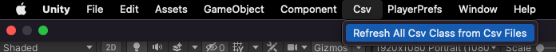
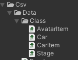
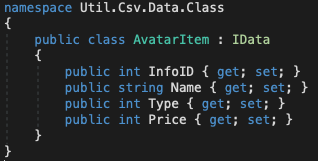

# Unity-Curve-Mission-Public

**Introduction.**

- Mobile Casual Racing Game
- Android/iOS
  

**Tech.**

- Unity3D / C#
- Firebase

**Programming.**

- Game Logic/UI

- **Ranking system** using firebase

- Local data(based on playerprefs) storage/read **encryption logic**

- Csv data **read** system

- Automate creation of **Csv data classes**

  1. Click button

  2. Check Csv data Classes

       

- **Unit Test** with Test Runner
  
  1. [Fast Version Video](https://www.youtube.com/watch?v=ft1lQnSj72Y)
  2. [Slow Version Video](https://www.youtube.com/watch?v=krco3HKtKTc)

- **Replay System** with Firebase Storage
  1. [Video](https://youtu.be/c6bCsLMQHNc)

